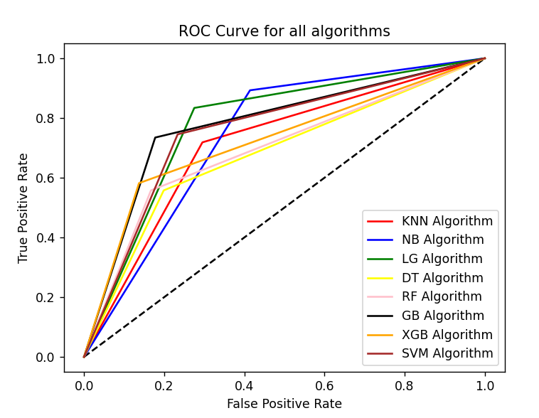

# Customer_Churn_Prediction_Using_Machine_Learning
---

# 📊 Customer Churn Prediction Project

## 📝 Project Description

This project focuses on predicting customer churn using the Customer Churn dataset. The goal is to identify customers likely to leave, allowing the company to take proactive retention actions.

The workflow covers **data preprocessing, feature engineering, outlier handling, feature selection, balancing, scaling, model training**, and **deployment** using Python and machine learning techniques.

---

## 📂 Dataset Overview

* **Source:** WA_Fn-UseC_-Telco-Customer-Churn
* **Rows:** 7043
* **Columns:** 21 features + Target (`Churn`)
* **Target Variable:** Churn (`Yes` = left, `No` = stayed)

### 🔑 Key Features

| Feature                                    | Description                          |
| ------------------------------------------ | ------------------------------------ |
| `gender`                                   | Male / Female                        |
| `Partner`, `Dependents`                    | Customer relationship information    |
| `InternetService`                          | DSL / Fiber optic / None             |
| `PaymentMethod`                            | Electronic check, Credit card, etc.  |
| `Contract`                                 | Month-to-month / One year / Two year |
| `Tenure`, `MonthlyCharges`, `TotalCharges` | Numeric variables                    |
| `Churn`                                    | Target variable (Yes/No)             |

---

## ⚙️ Workflow Summary

### 1️⃣ Data Loading & Missing Value Handling

* Loaded CSV data and converted `TotalCharges` to numeric.
* Handled missing values using **Random Sample Imputation**, filling missing entries from the training set to ensure consistency between train and test sets.

---

### 2️⃣ Outlier Treatment

* Applied **Log Transformation** on all numeric features to reduce skewness.
* Applied **IQR-based trimming** to limit extreme outliers.
* Final numeric columns were suffixed with `_log_trim` for clarity.

---

### 3️⃣ Feature Selection

* Removed **constant** and **quasi-constant** features using `VarianceThreshold`.
* Conducted **hypothesis testing** (Pearson correlation) to remove features with low predictive power.
* Removed multicollinear features automatically during preprocessing.

---

### 4️⃣ Categorical Encoding

* **One-Hot Encoding**: Categorical variables like `InternetService`, `PaymentMethod`, etc.
* **Ordinal Encoding**: `Contract` column to preserve natural order (Month-to-month < One year < Two year).
* **Label Encoding**: Target variable `Churn` (Yes → 1, No → 0).

---

### 5️⃣ Dataset Balancing

* SMOTE used to balance the dataset for minority class (Churn = Yes).

---

### 6️⃣ Feature Scaling

* Standardized numeric features using **StandardScaler** to ensure all features contribute equally.
* Scaled features improve model performance for algorithms sensitive to feature magnitudes (e.g., SVM, Logistic Regression).

---

### 7️⃣ Model Training & Evaluation

* Models trained:

  * **Gradient Boosting Classifier** (final model)
  * Logistic Regression
  * KNN Classifier
  * Decision Tree
  * Random Forest
  * XGBoost
  * SVM
  * Gaussian Naive Bayes

* **Metrics Used:** Accuracy, Precision, Recall, F1-Score, ROC-AUC

* **Final Model:** Gradient Boosting Classifier

  * Accuracy = 79%
  * ROC-AUC = 0.80
  * Balanced precision and recall after SMOTE

* **Model Performance Visualization:**
Below is the ROC–AUC curve representing the model’s ability to distinguish between churn and non-churn customers:

---

### 8️⃣ Deployment

* Backend: **Flask**
* Hosting: **Render Cloud Platform**
* Saved trained model and scaler (`churn_prediction_project.pkl`, `standard_scaler.pkl`)
* Users can input customer features through a web interface to get churn predictions.

---

## 🧰 Tools & Libraries

* **Python 3.9+**
* Pandas, NumPy
* Matplotlib, Seaborn
* scikit-learn, imblearn
* xgboost
* Flask

---

## 📈 Key Insights

* Customers on **month-to-month contracts** churn more frequently.
* **Fiber optic users** are more likely to leave.
* Customers without **dependents** or **partners** show higher churn.
* Payment by **electronic check** correlates with higher churn.
* **Tenure** and **contract length** are strong predictors of churn.

---

## 👨‍💻 Support

**Chavan Venkatesh** – Machine Learning & Data Science 

**Contact:** [cvvenkey06@gmail.com](mailto:cvvenkey06@gmail.com)  
**Render Deployment link:** [Customer Churn Prediction App](https://customer-churn-prediction-using-machine-245y.onrender.com)

---
